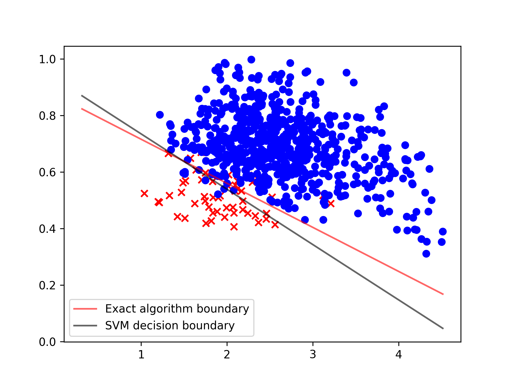
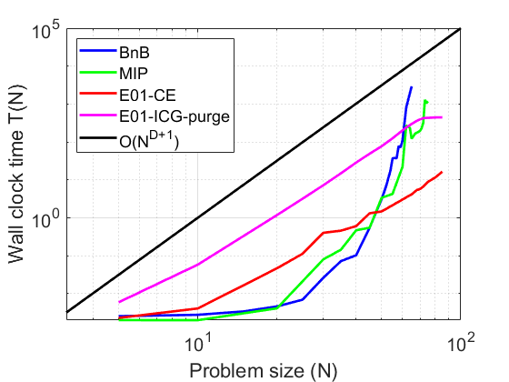

# E01Loss: A Python library for solving the exact 0-1 loss linear classification problem

Algorithms for solving the **linear classification problem** [1] have a long history, dating back at least to 1936 with Ronald Fisher's *discriminant analysis*. For linearly separable data, many algorithms can obtain the exact solution to the corresponding *0-1 loss classification* problem efficiently, but for data which is not linearly separable, it has been shown that this problem, in full generality, is NP-hard [2]. Alternative approaches all involve approximations of some kind, including the use of *surrogates* for the 0-1 loss (for example, the *hinge* or *logistic loss*) or approximate combinatorial search, none of which can be guaranteed to solve the problem exactly. Finding efficient algorithms to obtain an *exact* i.e. *globally optimal* solution for the 0-1 loss linear classification problem with fixed dimension $D$, is a long-standing problem. The E01Loss library provides Python implementations of several novel polynomial-time algorithms (currently: incremental combinatorial generation, incremental combinatorial purging, cell enumeration) which are provably correct and practical for small to medium-sized problems.

## Algorithms

* **Incremental combinatorial generation (E01-ICG)**: The E01-ICG algorithm generates candidate *class assignment configurations* incrementally, the 0-1 losses for these candidate configurations being updated in each iteration. During iteration, infeasible configurations (that is, ones which are not linearly separable or have 0-1 loss which is larger than the given approximate/heuristic upper-bound) are filtered out. In this way an exact solution is obtained in better than $O(N^{D+1})$ time, where $N$ is the number of data items and $D$ is the dimension of the feature space.

* **Incremental combinatorial purging (E01-ICG-purge)**: This algorithm is a variant of E01-ICG, which exploits a *finite-data dominance principle*. That is, a check is performed to find feasible configurations which cannot lead to a better 0-1 loss than some other configurations; those dominated solutions can safely discarded. In this way the E01-ICG-purge algorithm can often run faster than E01-ICG.

* **Cell enumeration (E01-CE)**:  This algorithm differs from the combinatorial algorithms above, in that it exploits geometric properties of the problem. First, the data in the feature space is transformed to a set of *dual hyperplanes*, then the linear classification problem becomes a *hyperplane arrangement* problem. The E01-CE algorithm obtains the exact solution by finding a *cell* in this arrangement with minimal 0-1 loss. The exact solution is found in $O(N^{D+1})$ time.

Although all algorithms have $O(N^{D+1})$ theoretical asymptotic run time complexity, the constant in E01-CE is much smaller than that of E01-ICG. When the approximate upper bound is not very tight, which typically occurs for challenging problems with large $N$ but small $D$, we suggest using E01-CE. Otherwise, E01-ICG/E01-ICG-purge are usually faster where the approximate upper bound is tight. All algorithms are designed to work with data in *general position*, that is, where the data is uniformly distributed in feature space. This means, for example, duplicate data items will violate this principle and should therefore be removed.

## Installation and getting started

We currently offer seamless installation with pip:

``` python
pip install e01loss
```

## Usage example

Load the library, read in a labelled data set, convert to +1/-1 class labels:

``` python
from e01loss.exact_classify01loss import *
import numpy as np
import time
from pkg_resources import resource_filename

data_fp = resource_filename('e01loss', 'test/voicepath_data.csv')
data = np.genfromtxt(data_fp, delimiter=',')
X = data[:, :2]
y = data[:, 2]
y[y == 0] = -1
```

Next, apply the E01-CE algorithm to input feature data `X` and label vector `y`:

``` python
optconfig, opt01loss, w, b = exact_classify01loss_cell(X, y, display=True, max_margin=True)
```

This returns the optimal classification `optconfig`, the corresponding exactly optimal 0-1 loss `opt01loss`, and the parameters of the maximum margin hyperplane, `w` and `b`.

## Classification performance on real-world data

An implementation of the exact algorithm on real-world data set voicepath_data.csv. This data set has $N=704$ data items in $D=2$ dimensions. In the below plot, the red line is the maximal margin boundary for the exact configuration which is obtained from our exact algorithm, and the black line is the support vector machine (SVM) algorithm result. The globally exact minimal 0-1 error is 19/704=2.7%, and the SVM 0-1 loss 23/704=3.3%.



We also test the performance of our algorithms against classical approximate methods, on some datasets from the UCI Machine Learning Repository [3] (in terms of 0-1 loss percentage error, lower is better, SVM regularization parameter $C=1,10^3,10^3,1,1.3\times10^6$, respectively):

| UCI data set        |  $N$ |  $D$ | Exact algorithms | Support vector machine (SVM) | Logistic regression | Fisher's linear discriminant |
| ------------------- | ---: | ---: | ---------------: | ---------------------------: | ------------------: | ---------------------------: |
| Habermans           |  306 |    3 |            21.6% |                        24.8% |               25.2% |                        25.2% |
| Caesarian           |   80 |    5 |            22.5% |                        26.3% |               26.3% |                        27.5% |
| Cryotherapy         |   90 |    6 |             6.7% |                         8.9% |                 10% |                          10% |
| Acute inflammations |  120 |    6 |               0% |                           0% |                  0% |                           0% |
| Blood transfusion   |  748 |    4 |            19.0% |                        22.6% |               22.9% |                        22.9% |

## Empirical run time complexity

Wall clock run time comparisons are shown in the figure below for synthetic data with $N$ ranging from 5 to 85 in $D=4$-dimensional feature space. This illustrates the typical performance for various algorithms: the state-of-the-art GLPK *mixed-integer programming solver* (MIP) [4], Nguyen et al.'s *Branch-and-Bound* (BnB) algorithm [5], E01-CE, E01-ICG-purge, and the asymptotic $O(N^{D+1})$, theoretical worst case for E01-CE and E01-ICG-purge. Vertical axis is log run time as a function of data set size $T(N)$, horizontal axis is log problem size $N$.

This (small) experiment suggests the following:

 * Run time of both MIP and BnB algorithms is (apparently) exponentially increasing with $N$

 * Our exact algorithms run much faster than BnB for $N > 40$

 * E01-ICG-purge is slower than E01-CE in this case, because the synthetic classification problem is very difficult (the globally optimal exact 0-1 loss value is about 33%, hence the approximate upper bound used in E01-ICG-purge will not be very tight)

   


## References

1. Cover, T. M. (1965). Geometrical and statistical properties of systems of linear inequalities with applications in pattern recognition. IEEE Transactions on Electronic Computers, (3), 326-334.
2. Guruswami, V., & Raghavendra, P. (2009). Hardness of learning halfspaces with noise. SIAM Journal on Computing, 39(2), 742-765.
3. Dua, D. and Graff, C. (2019). UCI Machine Learning Repository [http://archive.ics.uci.edu/ml]. Irvine, CA: University of California, School of Information and Computer Science.
4. https://www.gnu.org/software/glpk/
5. Nguyen, T.M., & Sanner, S. (2013). Algorithms for Direct 0-1 Loss Optimization in Binary Classification. International Conference on Machine Learning 2013.